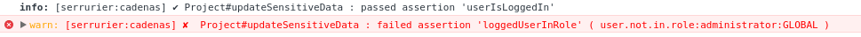

# *Serrurier*, a declarative extension for methods access control in [jagi:astronomy](http://jagi.github.io/meteor-astronomy/) using decorators

> **ℹ** *Serrurier* and *cadenas* are french words that stands respectively for *locksmith* and *padlock*.  
> **✔** This library aims to write more secure, maintainable and readable code, by defining function access through decorators.  
> **✔** It integrates smoothly with [alanning:meteor-roles](https://github.com/alanning/meteor-roles).  
> **✔** Allows to easely report suspect activity and model errors through [builtin or custom reporters](#reporters).
> **✔** Works with synchronous and asynchronous (through Meteor methods api) methods.

``` bash
meteor add svein-serrurier
```

## &#x1f512; *`@cadenas`* decorator
### Basics

> **ℹ** A *`@cadenas`* is an assertion that will trigger a specific `Exception` when it fails.  
> **ℹ** This (or those) assertions are run both **client** side and **server** side.  
> **ℹ** Those Exceptions are handled [by reporters](#reporters).  
> **ℹ**  The general syntax for *`@cadenas`* is `@cadenas( cadenasName, ...params )`  
> **ℹ** *`@cadenas`*  can target any function inside a `methods` description block.
> **ℹ** *`@cadenas`* can target any `events` handlers but **not in an array of handlers**. On any `Error` thrown by a cadenas, `e.preventDefault()` will be called.  
> **ℹ** It supports callbacks for `methods`.
> **ℹ** *Serrurier* is a very modular library and you can easely write your own *`@cadenas`* [within few lines of codes](#write-cadenas).   
> **⚠** To use decorators in your meteor project `@`), [follow those 2 straightforward steps](#decorators).  
> **⚠** To use `loggedUserInRole` *`@cadenas`*, you need to add `svein:serrurier-cadenas-roles` to your project.
> ```
> meteor add svein:serrurier-cadenas-roles
> ```

``` javascript
import { Serrurier, cadenas } from 'meteor/svein:serrurier';
import { Mongo } from 'meteor/mongo';

const Project = Serrurier.createClass({
  name: 'Project',
  collection: new Mongo.Collection( 'projects' ),
  methods: {
    // This is it
    @cadenas( 'loggedUserInRole', 'administrator' )
    updateSensitiveData() {
      // ...
      console.info( 'The assertion passed, user is administrator.' );
    }
  }
});
```
Then, if logged user is not in role 'administrator' and calls
``` javascript
(new Project()).updateSensitiveData();
```
This will output in the console ( if `Serrurier.lock()` has not been called ) :


Notice that the cadenas `'userIsLoggedIn'` has passed, because `'loggedUserInRole'` cadenas depends on it.

### List of available *`@cadenas`*

If you want, and you should, write your own cadenas, [go to this section](#write-cadenas).

#### `@cadenas( 'userLoggedIn' )`

> **asserts** that the user is logged in, with `Meteor.userId`.  
> **targets** `methods`, `events`  
> **throws** `SecurityException`  
> **params** none

#### `@cadenas( 'loggedUserInRole', role_s, partition )`

**⚠** You need to use [alanning:meteor-roles](https://github.com/alanning/meteor-roles) in your project to use this one, and add the following plugin :

```
meteor add svein:serrurier-cadenas-roles
```

> **asserts** that the logged user has role(s) in a specific scope (partition).
> **targets** `methods`, `events`  
> **throws** `SecurityException`  
> **depends** on `'userLoggedIn'` (will always check that user is logged in first)  
> **params**  
> > *role_s* One single or an array of role(s), i.e. string(s).   
> > *partition* The scopes in which the partition will apply. There is one special partition AUTO that resolves to `this.getPartition()` in the astro class instance, seee below.
> > ```javascript
> > import { parts } from 'meteor/svein:serrurier-cadenas-roles';
// ...
@cadenas( 'loggedUserInRole', 'responsible', parts.AUTO )
// ...
// parts.GLOBAL is the default value, it maps straight to Roles.GLOBAL_PARTITION
@cadenas( 'loggedUserInRole', 'responsible', parts.GLOBAL )
> > ```


#### `@cadenas( 'matchParams', paramsDescription )`

> **asserts** that all method arguments match the given paramsDescription.
> **targets** `methods`  
> **throws** `ValidationException`  
> **params**  
> > *paramsDescription* An array of [Meteor Match Patterns](https://docs.meteor.com/api/check.html#matchpatterns)


#### `@cadenas( 'userExists' )`
> **asserts** that the first argument of the class instance method is a string corresponding to an existing user.
> **targets** `methods`  
> **throws** `StateException`  
> **params** none


#### `@cadenas( 'persisted' )`

> **asserts** that the instance it is being called upon has been persisted (with `_isNew` property to false)  
> **targets** `methods`, `events`  
> **throws** `StateException`  
> **params** none

## *`@server`* decorator

> ```
> meteor add svein:serrurier-decorator-server
> ```  
> **ℹ** Applies to `methods` only.  
> **ℹ** Performs server-side only, you must provide a callback as last argument if you need the return value.  
> This callback has the following signature : `callback( [ Error ] error, { * } result )`

```javascript
import { Serrurier, server } from 'meteor/svein:serrurier';

//...
    @server()
    aMethodThatMustExecuteOnServer() {
      console.info( "Look, I'm running on server only." );
    }

```

Calling `aMethodThatMustExecuteOnServer` from client will call it on server. In the background, a Meteor method will be registered with the name `/serrurier/ClassName#methodName` through `Meteor.methods`.

<a name='decorators'>
## Adding legacy decorations (Meteor >= 1.3.4)
Follow those two simple steps :

> `meteor npm install -s babel-plugin-transform-decorators-legacy`

Then add at the root of your project a `.babelrc` file with the following content :
``` json
{
  "plugins": [
    "transform-decorators-legacy"
  ]
}
```
That's all you have to do!
## Security in production

You can prevent `Serrurier` from outputting anything in the console, and lock the API with one single `Serrurier.lock()` at the beginning of your application.
This cannot be reversed. Any consequitive call to any `Serrurier` static method will be ignored.

``` javascript
import Serrurier from 'meteor/svein:serrurier';
import 'meteor/jboulhous:dev'; // adds `Meteor.isDevelopment` flag

if(!Meteor.isDevelopment) Serrurier.lock();

```


<a name="reporters">
## reporters

> **ℹ** A reporter is exactly like an event listener for errors.   
> **ℹ** For each type of error, i.e. `SecurityException`, `StateException` and `ValidationException`, you can register a reporter.
> **ℹ** You can create your own errors with `import { createSerrurierException } from 'meteor/svein:'`
> **ℹ** By default, there is no reporting : the errors are just thrown up to the method call.
> **ℹ** A reporter takes one `security_context` argument that holds several informations :
>
``` javascript
* @typedef {object} security_context
* An object that holds information about the context of the execution.
*
* @prop {!string} action            - The 'Class#method' Astronomy signature who built the context
* @prop {!string} reason            - Why the access was forbidden?
* @prop {!string} errorId           - Unique identifier of the exception
* @prop {!string} stackTrace        - The stacktrace that generated this exception
* @prop {!object} target            - The target of the action
* @prop {object=} currentTarget     - The currentTarget of the action, i.e. a nested field of the target
*/
```


### to add one

``` javascript
// @locus client, server
import { Serrurier, SecurityException } from 'meteor/svein:serrurier';

Serrurier.registerReporter( SecurityException, function( context ) {
    console.info( context );
});
```
If you need a reporter that is executed on server, but listens to both client and server side errors, you need to use those utility functions :

Server side :
```javascript
// @locus server
import { SecurityException, Serrurier } from 'meteor/svein:serrurier';

Serrurier.publishServerReporter( SecurityException, function ( context ) {
    // Do some stuff
    console.warn( context );
});
```
Client side :
``` javascript
// @locus client
import { SecurityException, Serrurier } from 'meteor/svein:serrurier';

Serrurier.subscribeServerReporter( SecurityException );

```

Suits nicely for Error logging and suspect activity logging, see the Paranoid reporter bellow.  

### &#x1f47b; Paranoid reporter
This reporter listen for `SecurityException`s and log detailed information to the console.
It also keep track of those reports for 2 months.

```
meteor add svein:serrurier-reporter-paranoid
```

This is how a report looks like in the server console.
```
_______________________________ SERRURIER PARANOID REPORT _______________________________

        createdAt: new Date('2016-07-07T05:46:25.005Z'),
        ip: '127.0.0.1',
        geoInfo: 'localhost'
        userAgent: 'Mozilla/5.0 (X11; Linux x86_64) AppleWebKit/537.36 (KHTML, like Gecko) Ubuntu Chromium/50.0.2661.102 Chrome/50.0.2661.102 Safari/537.36',
        securityContext: {
                reason: 'User must be in  role : administrator, partition: GLOBAL',
                exceptionId: 'cadenas:logged-user-in-role',
                action: 'Project#updateSensitiveData',
                target: {
                        Project: {
                            plugins: {
                                   task: {
                                           _types: []
                                   },
                                   annotation: {
                                           _types: []
                                   }
                            },
                            isOpen: false,
                            publicationPolicy: true,
                            enablePlugins: false,
                            defaultCaptionSource: null,
                            pending: []
                          }
                },
                userId: 'JCwWgQZLExz5KrcDH'
        }
_________________________________________________________________________________________
```

You must import the package both on server and client.
On the server, you must call `config` once :

``` javascript
import {
  config,
  ONE_DAY,
  ONE_MONTH,
  ParanoidReports // This is the mongo collection
} from 'meteor/svein:serrurier-reporter-paranoid';

config({
    geotracking: true,
    ip_cache_ttl: ONE_DAY,
    record_ttl: ONE_MONTH
});


```

<a name="write-cadenas">
## Write your own *`@cadenas`*

### Composition with `Cadenas.partialFrom`

``` javascript
import { Cadenas } from 'meteor/svein:serrurier';
import { Match } from 'meteor/check';
/**
 * Assert the logged user is administrator
 * Note that you can override the ExceptionClass property when making partials.
 */
const loggedUserIsAdmin = Cadenas.partialFrom( 'loggedUserInRole' , {
    name: 'loggedUserIsAdmin',
    reason: 'Must be admin.'
}, 'administrator' );

```
Later in your project

``` javascript
@cadenas( 'loggedUserIsAdmin' )
methodThatMustBeRunByAdmin() {
      // Will be run by 'administrator'
}
```

### From scratch

```javascript
import { DefaultCadenas, Serrurier } from 'meteor/svein:serrurier';

// You can also use builtin exception like ValidationException, SecurityException and StateException
const MyException = Serrurier.createException( 'MyException' );

const myCustomCadenas = new DefaultCadenas({
    name: 'myCustomCadenas',
    reason: '',
    // [optional] The exception that will be thrown. Only reporters listening for this exception will be called upon assertion failures.
    // Default to SecurityException for 'DefaultCadenas' and ValidationException for 'MethodParamsCadenas'.
    // You shall use the utility function `Serrurier.createException` if you need to create your own.
    // They inherit Meteor.Error and can be thrown from server to client via callabcks. 
    ExceptionClass: MyException
    doesAssertionFails: function( myArg ) {
        // Does it need to throw an exception ?
        // Must NOT throw an error. Returns a non-empty string that will be appended to the `reason` context property when an error should be thrown
        // else return false
    },
    // The cadenas signature (i.e. `doesAssertionFails` signature)?
    // You must describe any parameter here to keep the API consistent.
    // Use Match.Any if you don't want to test an input, however this is not recommanded.
    matchPatterns: [ Match.Optional( String ) ],
    // [optional] A set of depending assertions in the form of a dictionary which keys are cadenas names, and values an array with their `doesAssertionFails` params.
    dependingCadenas: { userIsLoggedIn: [] }

});
```
